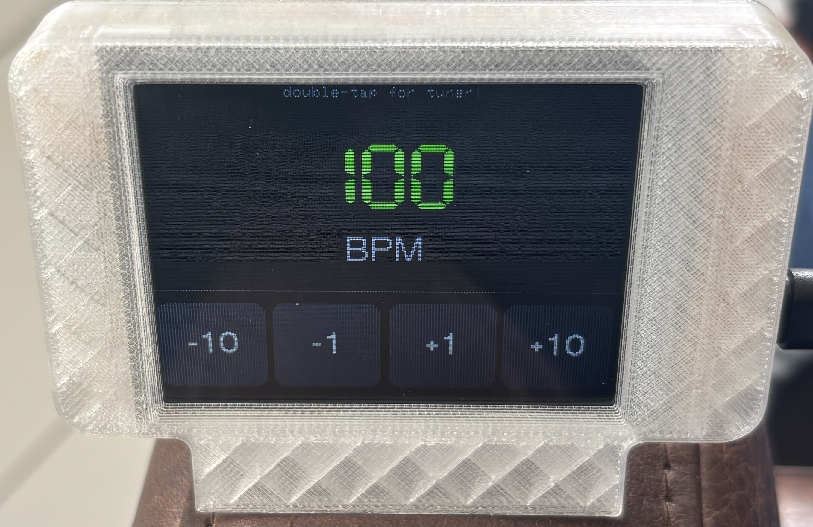

# cyd-metronome

cyd-metronome is a fully-functional metronome AND tuner built entirely on an ESP32-CYD, a $12 devboard with a display, as well as a $0.10 buzzer and a $1 microphone sensor - the KY-038!

A demo YouTube video showing how this program works can be found [here](https://youtu.be/Uan7boKpzxo).

# About

The CYD (Cheap Yellow Display) is one of the most versatile devboards to ever exist, and cyd-metronome takes full use of its functions.

This was made as an additional example to add to [Hack Club Framebuf](https://framebuf.dino.icu/), a YSWS that I designed as a part of the Gap Year Application and hope to run one day.

cyd-metronome has two modes: **Metronome** and **Tuner**. The Tuner mode pulls from the logic I used in my polyphonic tuner [kanōn](https://kanon-phi.vercel.app/), and condenses it on a simpler level to work on CYD! In Metronome mode, the CYD flashes the screen AND buzzes an attached buzzer to the BPM set on-screen.

# BOM

The only item you technically require for this software is a CYD, but the tuner and sound wont work.

Therefore, for this program to be fully functional, you require:

1x ESP32-CYD, any model works, I used https://www.amazon.com/dp/B0FPLX98VG/.
1x Generic Active Buzzer, the ones in any electronics kit work, I used https://www.amazon.com/dp/B0CM63HJHQ/.
1x KY-038 Sound Sensor, I used https://a.co/d/05BV55X7/.

I additionally used a 3D-Printed case in my demo video, its not required for the tuner to function. If you'd like to print one yourself, it can be found at https://makerworld.com/models/1810329/.

# Installation

To use cyd-metronome, compile and build the program and flash it onto your CYD. The easiest way to do this is to clone this repository:

`git clone https://github.com/newtontriumphant/cyd-metronome`

Then CD into it:

`cd cyd-metronome`

Then open it in VS Code (make sure you have the PlatformIO extension initialized), and select it as a PlatformIO project.

After that, click the Compile and Upload button (->) in the bottom taskbar, and make sure your CYD is plugged in via the **Micro-USB** port (the USB-C port does not support data transfer). Then, the program should upload and compile in around a minute.

# Wiring

The CYD-Metronome has some optional modules that highly improve its functionality. These are a **Active Buzzer** (generic, any model works) wired to **IO22** (blue wire) and **GND** (black wire), and a **KY-038 Sound Sensor** (wire black wire to GND, red wire to 3.3v, and the yellow wire to the module's A0 pin). The D0 pin on the KY-038 can be left unconnected.

# Usage

The usage of CYD-metronome is actually pretty simple - turn it on (you can power it with a common 3.7v lipo battery via the VIN port, or a USB-C or Micro-USB cable), and you're in the Metronome mode by default. To turn up or down the BPM, press the buttons. To switch to Tuner mode, double-tap or press and hold on any part of the screen! In Tuner mode, everything is automatic, assuming your sensor is connected.

This software is licensed under the MIT License. See [/cyd-metronome/LICENSE](https://github.com/newtontriumphant/cyd-metronome/blob/main/LICENSE) for more information.

Made with <3 by zsharpminor, final submission for Hack Club: The Game.